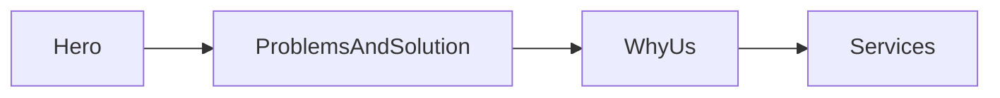
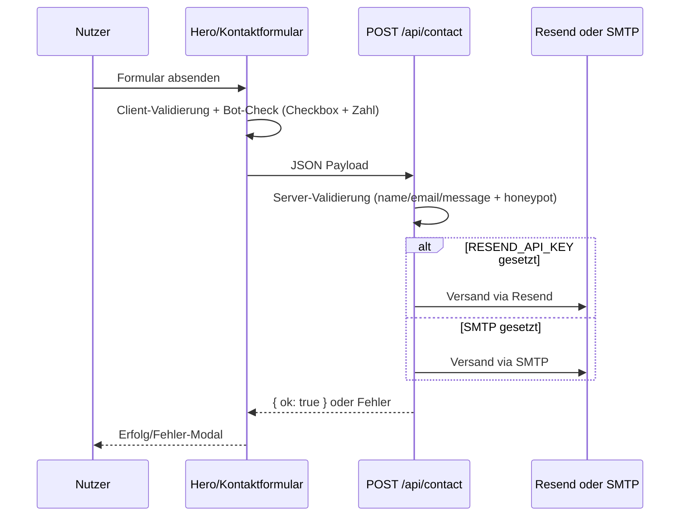
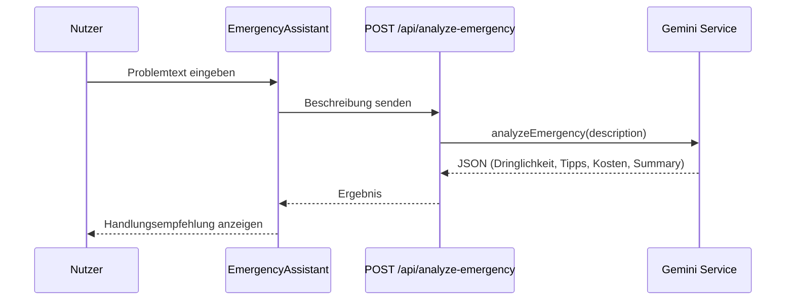
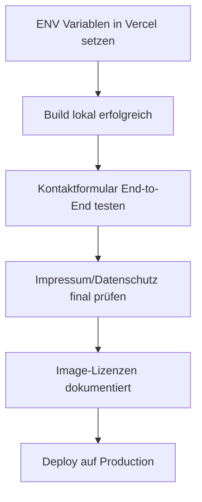

# Projekt-Dokumentation – Elektro Volt Website

Stand: 2026-03-01
Technologie: Next.js 15 (App Router), React 19, TypeScript, Tailwind CSS

## 1) Ziel des Projekts

Diese Website ist eine lokale Service-Seite für Elektro Volt (Wien) mit Fokus auf:
- Notdienst-Anfragen (24/7)
- Lead-Generierung über Kontaktformular
- SEO-Landingpages für lokale Suchintentionen
- Vertrauensaufbau über Referenzen, Problemlösungen und klare Leistungen

---

## 2) System-Architektur (High-Level)

```mermaid
graph TD
    U[Besucher / Kunde] --> FE[Next.js Frontend - App Router]

    FE --> P1[Seiten - app/*]
    FE --> C1[UI-Komponenten - components/*]
    FE --> CFG[Konfiguration - lib/config.ts]

    FE --> API1[/api/contact]
    FE --> API2[/api/analyze-emergency]
    FE --> API3[/api/get-images]
    FE --> API4[/api/cookie-preferences]

    API1 --> R1[Resend]
    API1 --> S1[SMTP Fallback]

    API2 --> G1[Google Gemini API]

    API3 --> FS1[Dateisystem - public/workPicture]

    API4 --> CK1[Cookie Speicherung]

    FE --> AS1[Assets - public/picture & public/workPicture]
    FE --> SEO1[Metadata, robots, sitemap, LocalBusinessSchema]
```

---

## 3) Seitenfluss (Homepage)



Aktuelle Reihenfolge wird in app/page.tsx gerendert.

---

## 4) Kontaktformular-Datenfluss



---

## 5) KI-Notfallanalyse Datenfluss



Fallback: Ohne GEMINI_API_KEY wird eine sichere Standardantwort geliefert.

---

## 6) Projektstruktur (vereinfacht)

- app/
  - layout.tsx: Globales Layout, SEO-Metadaten, Header/Footer, CookieBanner
  - page.tsx: Startseite
  - api/
    - contact/route.ts: E-Mail-Lead-Endpoint
    - analyze-emergency/route.ts: KI-Analyse
    - get-images/route.ts: Liefert Work-Bilder aus public/workPicture
    - cookie-preferences/route.ts: Speichert Cookie-Einstellungen
  - weitere SEO-/Landingpages (leistungen, faq, datenschutz, impressum, etc.)
- components/
  - Hero, Header, Footer, WhyUs, Services, ProblemsAndSolution, CookieBanner, EmergencyAssistant, usw.
- lib/
  - config.ts: zentrale Firmen-/Routing-/Text-Konfiguration
  - geminiService.ts: Gemini-Integration
  - services.tsx: Leistungsdaten
- public/
  - picture/: Branding-/Hero-Bilder
  - workPicture/: Einsatz-/Projektbilder

---

## 7) Zentrale Komponenten und Verantwortungen

- Header
  - Hauptnavigation, mobile Menüs, Notdienste-Dropdown, Telefon/WhatsApp CTA
- Hero
  - Primäre Conversion-Fläche, Kontaktformular mit Client-Botcheck
- ProblemsAndSolution
  - Problemkatalog + Trust + Google-Bewertungen-Block
- WhyUs
  - Trust-Argumente + Bild-Panel mit Slider/Modal
- Services
  - Leistungsdarstellung (Carousel/List) mit interner Navigation
- Footer
  - Rechtliche Links, Kontaktdaten, Öffnungszeiten

---

## 8) API-Endpunkte

### POST /api/contact
- Zweck: Kontaktanfragen per E-Mail versenden
- Validierung: name, email, message, honeypot `_gotcha`
- Versandstrategie:
  1. Resend (wenn RESEND_API_KEY gesetzt)
  2. SMTP-Fallback

### POST /api/analyze-emergency
- Zweck: KI-basierte Ersteinschätzung
- Input: `{ description: string }`
- Output: urgency, safetyTips, estimatedCostRange, summary

### GET /api/get-images
- Zweck: Work-Bilder aus Dateisystem auflisten

### POST /api/cookie-preferences
- Zweck: Consent in Cookie speichern

---

## 9) Konfiguration & ENV-Variablen

### Pflicht für produktiven Mailversand
- RESEND_API_KEY
- RESEND_FROM
- CONTACT_TO

### Pflicht für korrekte Rechtsdaten
- NEXT_PUBLIC_COMPANY_UID_NUMMER
- NEXT_PUBLIC_COMPANY_FIRMA_NUMMER

### Optional
- GEMINI_API_KEY
- SMTP_HOST, SMTP_PORT, SMTP_USER, SMTP_PASS, SMTP_SECURE
- NEXT_PUBLIC_SITE_URL

Hinweis: Details und Beispielwerte siehe .env.example.

---

## 10) SEO-Setup (bereits vorhanden)

- Globale Metadata in app/layout.tsx
- robots via app/robots.ts
- sitemap via app/sitemap.ts
- JSON-LD LocalBusinessSchema
- Lokale Landingpages für Suchintentionen (z. B. /elektriker-wien)

---

## 11) Sicherheit & Compliance (aktueller Stand)

Vorhanden:
- Serverseitige Eingabevalidierung bei Kontakt
- Honeypot-Feld gegen einfache Bots
- Cookie-Consent-Mechanik

Empfohlen vor finalem Launch:
- Rate-Limiting für /api/contact
- ReCAPTCHA/hCaptcha serverseitig (optional, aber sinnvoll)
- Bildlizenz-Dokumentation pflegen (siehe IMAGE_LICENSES.md)

---

## 12) Deployment-Checkliste



Kurzliste:
1. ENVs in Vercel setzen
2. Produktions-Build erfolgreich
3. Kontaktformular getestet (Resend/SMTP)
4. Rechtsdaten final korrekt
5. Lizenzstatus aller Bilder dokumentiert

---

## 13) Bekannte technische Hinweise

- next lint ist in Next.js 16 deprecated (Migration auf ESLint CLI später sinnvoll)
- Mehrere Lint-Warnungen (unused imports, img statt next/image) sind aktuell nicht blockierend
- Bei gelegentlichem Dev-Manifest-Fehler hilft: npm run dev:clean

---

## 14) Wartungsempfehlung

- Konfigurierbare Inhalte weiterhin zentral in lib/config.ts halten
- Für neue Landingpages dieselbe SEO-Metadatenstruktur verwenden
- Bei Medien-Upload direkt Lizenzquelle mitdokumentieren (IMAGE_LICENSES.md)

